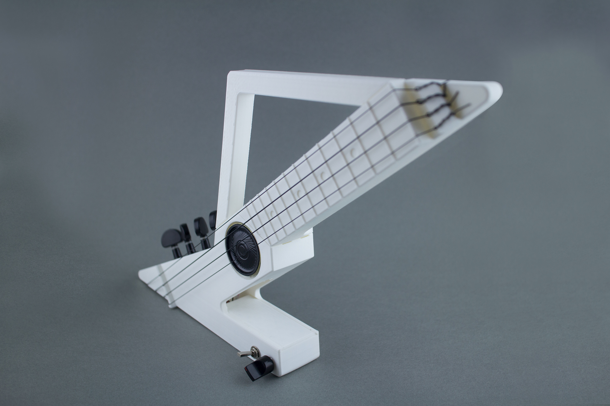

# Lightning Uke Assembly Instructions 

## 1. Prepare Printed Parts  

Download [STL files](https://github.com/UkuleleDesign/LightningUke/tree/master/stl) for 3D printing. Print all 3 files in PLA, with following configuration:

* Infill: 20%
* Layer height: 0.20 mm
* Shells: 2 
* Support material and raft: No

Depends on the printer size, you might need to rotate the model in 45 degrees

The whole prints takes around 15.5 hours (body: 9 hours, neck: 4 hours, handle: 2.5 hours) on a Replicator 2. You can also [purchase](http://ukulele.design/#purchase) a DIY kit from the project website
	
## 2. Assemble the Body

Slide the handle into neck, and insert joints into body

Snap it together to finish the body 

## 3. Install Tuners

Get 4 sealed geared tuners, note there are left and right orientations

Slide tuners into body, tighten screw with washer

## 4. String It Up

Get a set of 21 inch (soprano) ukulele strings 

Start with the 4th string, insert it into the top-most hole of headstock 

Go around itself for a loop

Make two more loops in the same direction 

Pull on the long end of string to tighten the knot

Wrap the string over the bridge and around the body, insert into the tuner peg hole 

Tighten and tune

Finish rest of the 3 strings 

Make sure strings sit in their corresponding bridge slots

And in nut slots as well, trim the strings as needed

Now you have a non-electrified ukulele!

## 5. Solder the Circuit 

Get your tools and electronic parts based on the [component list](https://github.com/UkuleleDesign/LightningUke/blob/master/ComponentList.md)

 

Solder the amplifier circuit by using this layout, or adjust as you need. There are many examples of LM386 based amplifier circuit can be found online

Solder the speaker, piezo and 6.3mm jack with wires

## 6. Assemble the Electronic Parts

Slide the speaker underneath strings, glue it in the cavity

Glue the piezo at the bottom of body 

Install switches, jack and circuit board, save some space for 9V battery

Snap the battery in and insert the cover, your Lightning Uke is done! 

