# Lightning Uke Assembly Instructions 

## 1. Prepare Printed Parts  

Download [STL files](https://github.com/UkuleleDesign/LightningUke/tree/master/stl) for 3D printing. Depends on the printer size, you might need to rotate the model in 45 degrees. 

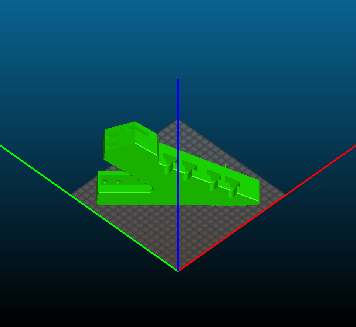

Print all 3 files in 20% infill rate, with no support material and at least 2 layers of shell 

	
## 2. Assemble the Body

Slide the handle into neck, and insert joints into body

Push it through to finish the body 

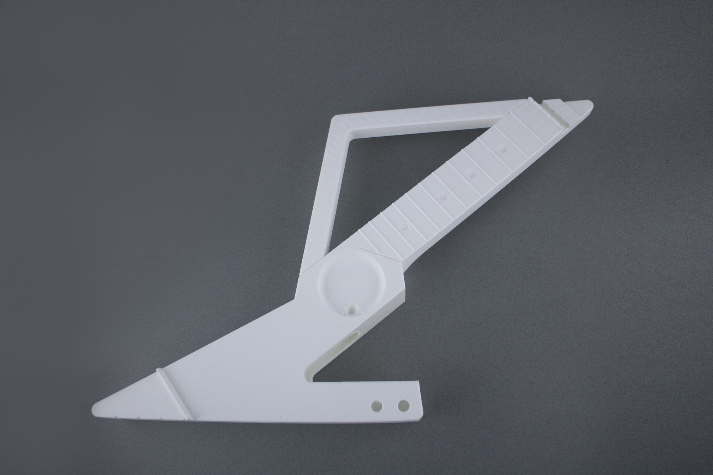

## 3. Install Tuners

Get 4 sealed geared tuners, note there are left and right orientations

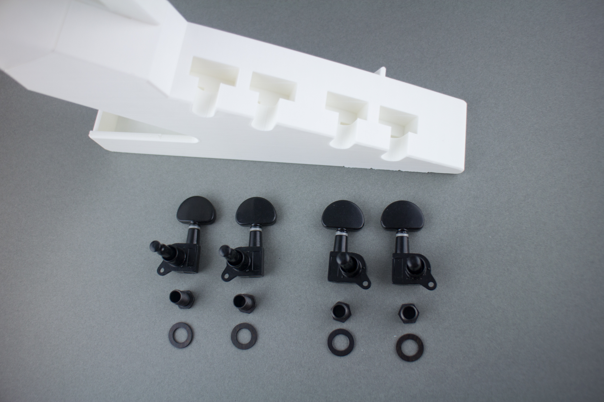

Slide tuners into body, tighten screw with spacer

## 4. String It Up

Get a set of 21 inch (soprano) ukulele strings 

Start with the 4th string, insert it into the top-most hole of headstock 

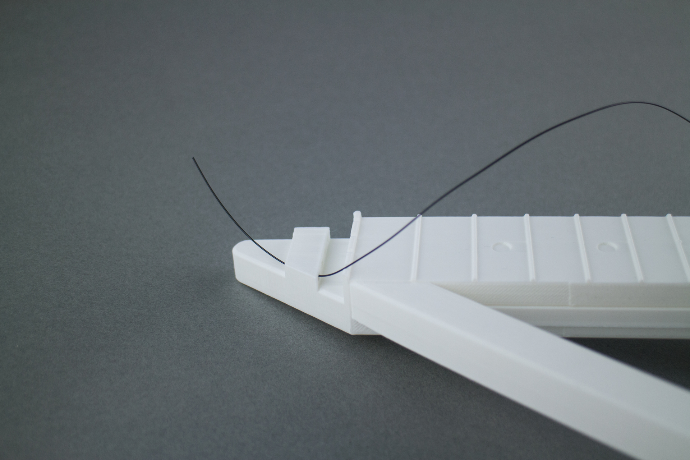

Go around itself for a loop

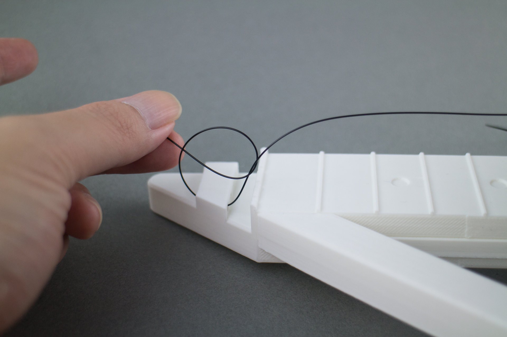

Make two more loops in the same direction 

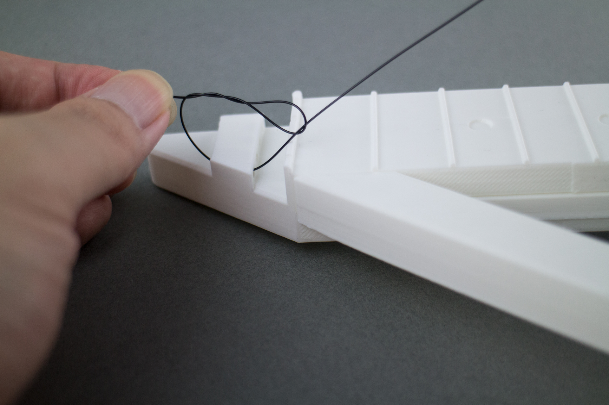

Pull on the long end of string to tighten the knot

Wrap the string over the bridge and around the body, insert into the tuner peg hole 

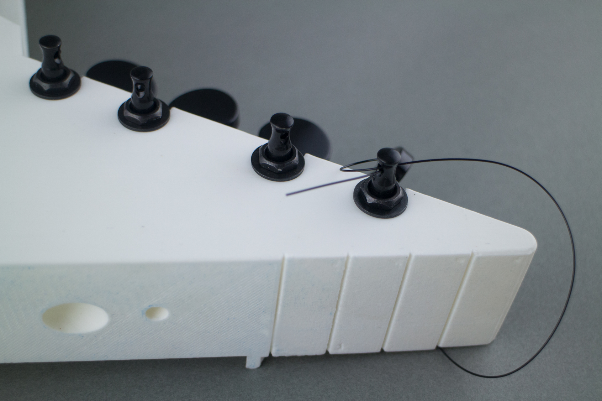

Tighten and tune

Finish rest of the 3 strings 

Make sure strings sit in their corresponding bridge slots

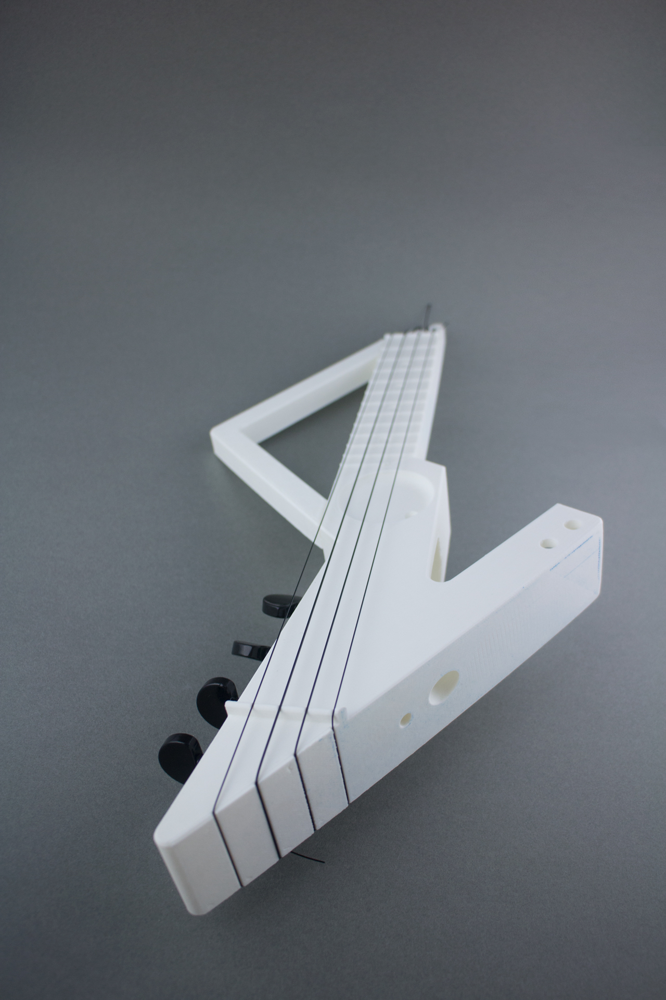

And in nut slots as well, trim the strings as needed

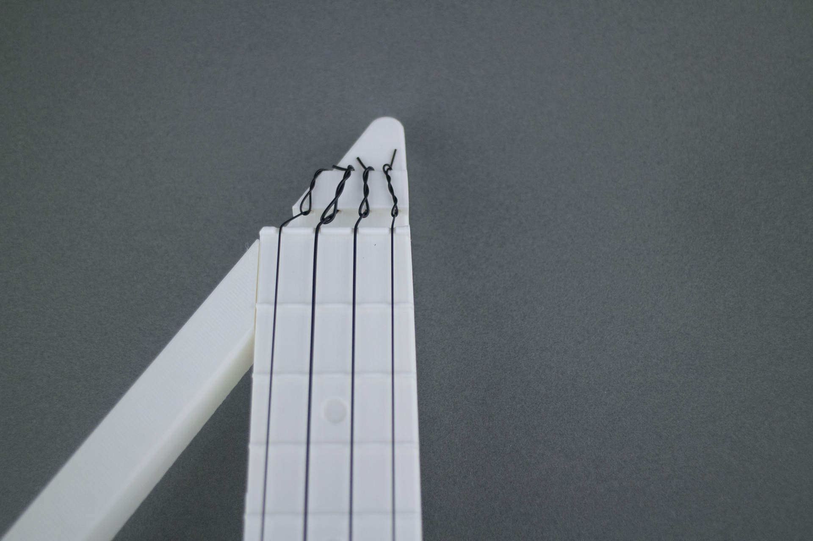

Now you have a non-electrified ukulele!

## 5. Solder the Circuit 

Get your tools and electronic parts based on the [component list](https://github.com/UkuleleDesign/LightningUke/blob/master/ComponentList.md)

 

Solder the amplifier circuit by using this layout, or adjust as you need. There are many examples of LM386 based amplifier circuit can be found online

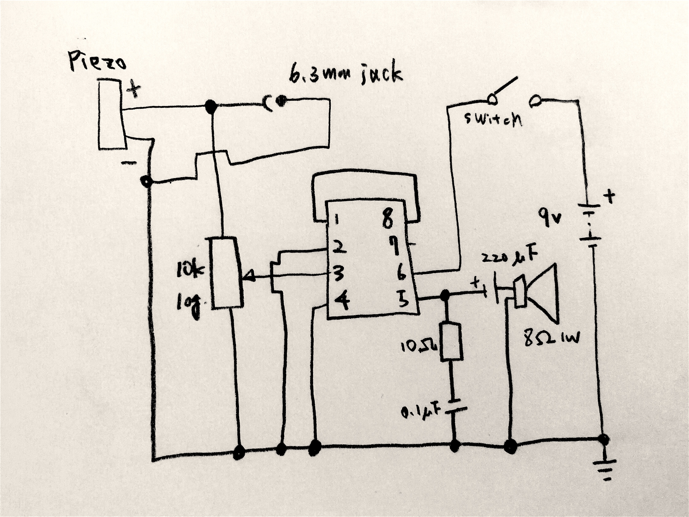
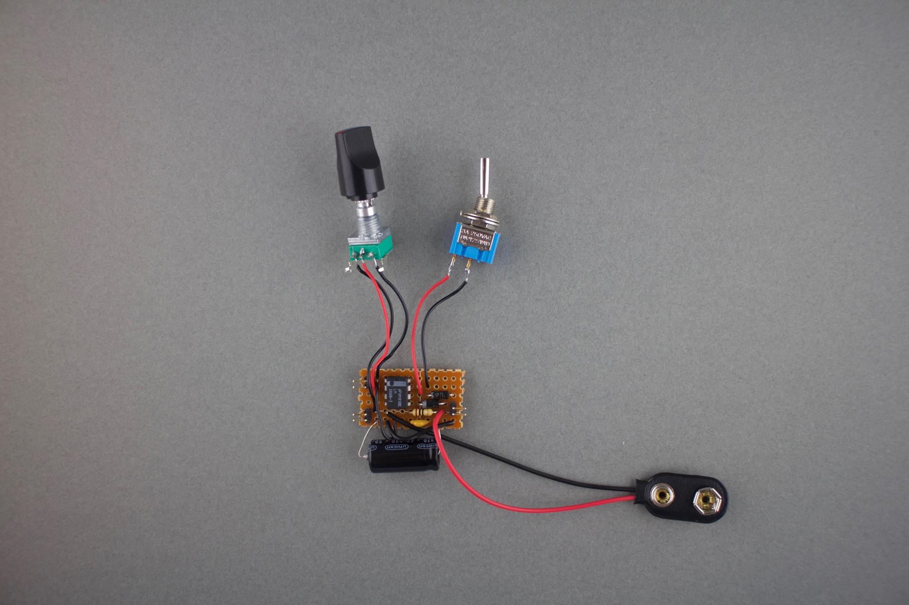

Solder the speaker, piezo and 6.3mm jack with wires

## 6. Assemble the Electronic Parts

Slide the speaker underneath strings, glue it in the cavity

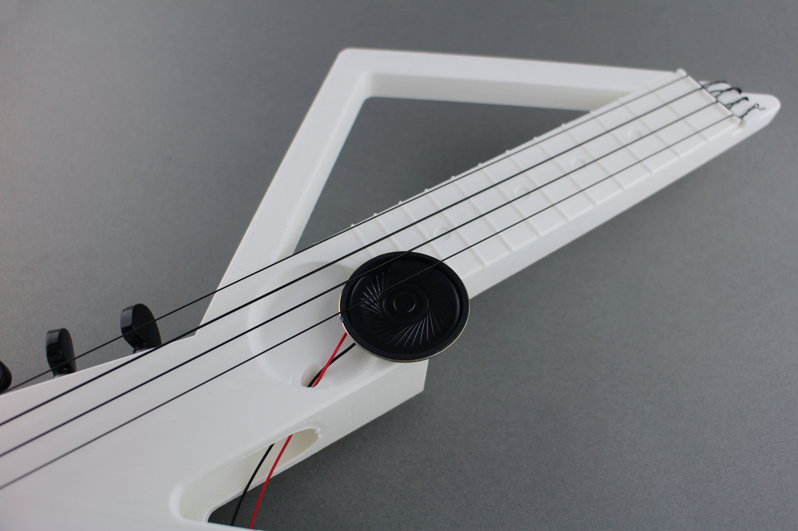

Glue the piezo at the bottom of body 

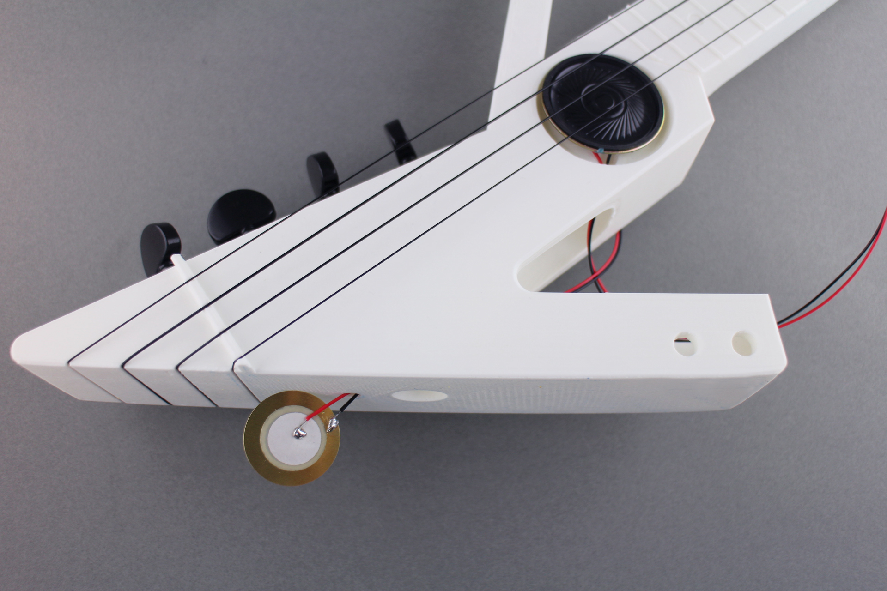

Install switches, jack and circuit board, save some space for 9V battery

Snap the battery in and insert the cover, now we are done! 

